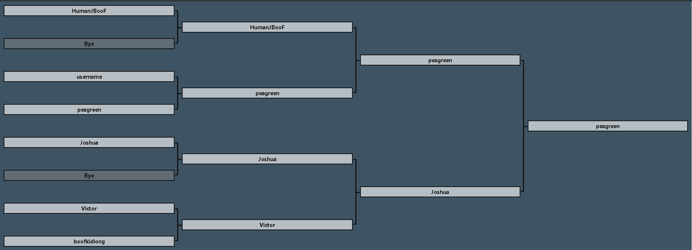

[](http://hits.dwyl.io/humanjboof/https://github.com/HumanJBooF/brak-its) [](https://github.com/HumanJBooF/brak-its/issues)
[](https://github.com/HumanJBooF/brak-its)

[](https://brak-its.herokuapp.com)     

#### Welcome to [ Brak-its ] an app that allows users to create a tournament and play with friends all over the world.



### Contents 
- [Current Features](#current-features)
    - [Coming Soon](#features-coming-soon)
- [Tech used](#technologies-used)
- [Authors](#authors)
- [Local](#quick-reference-for-local-set-up)


### Current Features 

- Create a username and safely sign up/in 
- User created tournaments
    - Users are seeded based on join order of the tournament

- Users who create tournaments have full control over when they start, and picking a winner for each match.
    - If you don't have the full list of players, the event owner still has a choice to start it, with bye weeks if necessary
 
- If you have a full group of players, start will be normal


- Once started, the event owner will have access to each match as buttons to determine who will go to the next round

 

- If you cancel, the player will not be sent.

### Features coming soon

- Owner page for creators of tournaments where you can edit/delete/view all your tournaments.
    - This will be a "Manager" page, it will bring more admin privileges and more over all QoL changes 
- User profile page
    - A place where a user can add a bio and other interest and track all the tournaments they have played in.
- Results page for each tournament
    - More robust results page, where you can see first, second and third place and a list of each matches wins and losses.
- Round robin, double elimination, ladders/leagues, team play
- Chat features
- A friends list
    - A place to keep all your friends that you like to play with
- View other users tournaments and history
    - Have access to looking at others profiles and history
- More in-depth readme
- Redux


## Technologies Used
- [React](https://reactjs.org/) - Web framework
- [Express](https://expressjs.com/) - Web framework
- [Passport.js](http://www.passportjs.org/) - Authentication tool
- [Bcrypt](https://www.npmjs.com/package/bcrypt) - Password Protection
- [Materialize](https://www.materializecss.com/) - CSS framework
- [Sequelize](https://docs.sequelizejs.com/) - ORM and management tool
- [MySql](https://www.mysql.com/) - Relational Database
- [Heroku](https://www.heroku.com/) - Hosting platform
- [Axios](https://www.npmjs.com/package/axios) - Promised based HTTP client
- [Vagrant](https://www.vagrantup.com/) -Virtualization
- [Docker](https://www.docker.com/) - Containerization


## Authors
**|| [Joshua LeBoeuf](https://github.com/humanjboof) || [Jake Plaisted](https://github.com/spaceTab) || [Mason Hester](https://github.com/MasonHester) ||**


## Quick Reference for local set up
* React Dev Server (frontend)
  * http://192.168.90.20:3000*
* Express API (backend)
  * http://192.168.90.20:3001/api*
  * **IMPORTANT**: If you modify `/api/package.json` or `/api/.env` you will need to run `npm run docker:build` to update the image
  * React Proxys HTTP requests to 3001 in Dev mode (see `package.json`)
* MySQL
  * Port: 3306
  * User: root
  * Password: root
* Docker Environment Configuration
  * Full-Stack Environment: [docker-compose.yml](docker-compose.yml)

## [Notable] File Structure
This is not an exhaustive list, just some worth noting

```
+-- /api                          : Express Server
|   +-- /.env.sample              : Sample .en
|   +-- /package.json             : Express dependencies
+-- /Public                       : React Public assets
+-- /src                          : React App Source
+-- /.dockerignore                : Docker copy ignore (https://docs.docker.com/engine/reference/builder/#dockerignore-file)
+-- /Dockerfile                   : Docker Deploy build spec for React/Express/Heroku (production build/deploy)
+-- /Dockerfile.express           : Docker build spec for (local) Express
+-- /Dockerfile.react             : Docker build spec for React (local) dev server
+-- /docker-compose.yml           : Full Stack Docker environment spec (local development)
+-- /provision.sh                 : Provisioner for Vagrant VM
+-- /vagrantfile                  : Vagrant VM definition
```

Start up the VM with `vagrant up`. Once booted, `vagrant ssh` to access the terminal, and change to the `/var/www` folder where the entire contents of this application is mounted as a shared folder.

> **Note** - if your OS supports Docker without the helper VM, it's just as easy to run this application locally with Docker instead of within the VM. **Dealers choice**!

### Starting Full Stack Environment

> **First** - if you are going to need custom `environment` variables, copy `/api/.env.sample` to `/api/.env`. This file **will not be committed to source control** and is intended for local development only. These values should be matched in **Heroku Config Vars** for production apps.

To start the local development environment, run this command:

`docker-compose up`

> Inside a VM, run this command from `/var/www`

This command will read the `docker-compose.yml` file, which specifies **build** parameters (in [Ruby syntax](https://docs.docker.com/engine/reference/commandline/build/#extended-description)) that sets up the local development environment. This is **not a production build**, this is for local only.

> **Note**: first run will build all three images (see manual rebuilding below), and will take several minutes. Subsequent restarts should be very quick.

### Terminating Environment
While `docker-compose` is running, press `CTRL+C`. Status will show Docker container instances terminating. If the environment is running in the background (`-d` command line param), you can use `docker-compose down` to terminate the environment.

### Manually rebuilding the images (not usually necessary)
`docker-compose build`
> **Note**: This runs only once automatically, on first `docker-compose up`. It should not need to be manually run again unless there is a need to delete an image from docker ([`docker rmi [imageGuid]`](https://docs.docker.com/engine/reference/commandline/image_rm/)).

> **Another Note**: It's **completely** harmless to run this at any point in time. Doing this will re-install any missing packages in your containers as long as you have not removed the `npm install` statements from each `Dockerfile`.

### Connecting to MySQL/Mongo with a client
MySQL/Mongo running as a Docker container registers itself on the local machine, so the host is `localhost` or, more reliably, `127.0.0.1` loopback address. The username and password (defined in `docker-compose.yml`) default to `root`, and the port is default `3306` for MySQL and default `27017` for Mongo.

### Docker Cleanup
There is an npm script in `package.json` that will clean up "dangling" images from Docker. Every so often it's recommended you run this command:

`npm run docker:clean`
